# Tutorial 2: Interspecific Ecometabolomics

## Overview

This tutorial introduces an interspecific ecometabolomics workflow using
the `eCOMET` package to analyze multiple tree species that co-occur
across a network of forest plots. We begin by comparing chemical
richness and diversity across samples, then examine differences in
overall composition using multivariate approaches such as hierarchical
clustering, PCA, NMDS, and PCoA.

The first half of the tutorial uses feature-based methods, which treat
each detected MZ-RT feature as an independent unit. These approaches are
useful for summarizing the number of detected features and for comparing
samples based on shared compound signals. However, this assumption is
often imperfect in untargeted metabolomics because multiple detected
features can arise from the same underlying metabolite through adducts,
isotopes, or in-source fragments.

This limitation becomes especially important in interspecific datasets.
Unlike treatment-based studies, where many compounds are shared among
groups and the goal is to identify differential metabolites,
species-level comparisons frequently involve samples that share
relatively few exact features. As a result, similarity metrics based
only on feature overlap can underestimate biologically meaningful
relationships among samples.

To address this, the second half of the tutorial introduces
structure-aware approaches that account for associations among features.
These methods incorporate information from feature grouping, ion
identity relationships, molecular networking, and chemical similarity so
that samples can be compared not only by exact shared features, but also
by the relatedness of the compounds they contain. This provides a more
biologically realistic framework for interspecific metabolomic
comparisons.

This tutorial is organized into the following sections:

- [1. Load input data and build the MMO
  object](#id_1-load-input-data-and-build-the-mmo-object)
- [2. Inspect the core data tables](#id_2-inspect-the-core-data-tables)
- [3. Compare feature richness across samples and
  species](#id_3-compare-feature-richness-across-samples-and-species)
- [4. Add SIRIUS annotations and inspect class
  composition](#id_4-add-sirius-annotations-and-inspect-class-composition)
- [5. Compare samples with feature-based multivariate
  methods](#id_5-compare-samples-with-feature-based-multivariate-methods)
- [6. Add structural relationships among
  features](#id_6-add-structural-relationships-among-features)
- [7. Recalculate beta diversity using chemical
  distances](#id_7-recalculate-beta-diversity-using-chemical-distances)
- [8. Revisit alpha diversity with structure-aware
  metrics](#id_8-revisit-alpha-diversity-with-structure-aware-metrics)
- [Key takeaways](#key-takeaways)

The package can be loaded or updated as needed using Pak:

``` r
#install
#pak::pak("phytoecia/eCOMET")

#upgrade
#pak::pak("phytoecia/eCOMET", upgrade = TRUE)
```

``` r
library(ecomet)
library(dplyr)
library(ggplot2)
library(ape)
library(colorspace)
```

## 1. Load input data and build the MMO object

The first step is to point `eCOMET` to the processed feature table, the
sample metadata, and any optional annotation files that will be used
later in the workflow.

Before calling
[`GetMZmineFeature()`](https://phytoecia.github.io/eCOMET/reference/GetMZmineFeature.md),
it is useful to understand what the `mmo` object is. In `eCOMET`, the
`mmo` object is a container that keeps the feature matrix, feature
metadata, sample metadata, and later annotation and distance information
together in one place. This matters because most downstream functions
expect these pieces to stay aligned. By storing them in a single object,
we reduce the chance of mixing up sample order, dropping feature
identifiers, or applying annotations to the wrong feature table.

``` r
data_dir <- system.file(
 "extdata/tutorials/interspecific",
 package = "ecomet"
)
stopifnot(nzchar(data_dir))  # fail loudly if package data is missing
#data_dir <- "/Users/dlforrister/Library/CloudStorage/OneDrive-SmithsonianInstitution/One_Drive_BackUps_Local_Mac_Files/CODE_GIT_HUB_2017_Aug_31/eCOMET/inst/extdata/tutorials/interspecific"

demo_feature          <- file.path(data_dir, "Ecomet_Interspecific_Demo_full_feature_table.csv")
demo_metadata         <- file.path(data_dir, "EcoMET_Interspecific_Demo_metadata_no_blank.csv")
demo_sirius_formula   <- file.path(data_dir, "canopus_formula_summary.tsv")
demo_sirius_structure <- file.path(data_dir, "structure_identifications.tsv")
demo_dreams           <- file.path(data_dir, "Ecomet_Interspecific_Demo_dreams_sim_dreams.csv")
```

## Initialize eCOMET object

``` r
mmo <- GetMZmineFeature(mzmine_dir=demo_feature, metadata_dir = demo_metadata, group_col = 'Species_binomial', sample_col = "filename")

mmo
```

After this step, `mmo` becomes the main object passed through the rest
of the tutorial. As you add normalization results, structural
annotations, or chemical distances, they are stored within the same
object and can be reused by later functions.

## 2. Inspect the core data tables

Building the `mmo` object creates several linked components. It is good
practice to inspect these early so you know what information is
available and can catch formatting problems before starting analysis.

### 2.1 Sample metadata

The sample metadata table describes each sample and records the grouping
variables used in the analysis. This is the table to inspect when you
want to confirm sample names, group assignments, replicate structure, or
any additional sample-level covariates.

We are working with a dataset containing 10 species of tropical trees
with 5-8 replicate samples for each species.

``` r
mmo$metadata
```

When
[`GetMZmineFeature()`](https://phytoecia.github.io/eCOMET/reference/GetMZmineFeature.md)
is called, `group_col = "Species_binomial"` tells `eCOMET` which
metadata column should define the biological groups used throughout the
analysis, and `sample_col = "filename"` tells it which metadata column
matches the sample columns in the feature table. Those two mappings are
what allow `eCOMET` to connect sample abundances to the correct species
labels.

### 2.2 Feature information

The feature information table stores identifiers and per-feature
descriptors. This is the table to inspect when you need to trace a
feature back to its measured properties, match features across steps, or
merge in annotation data.

``` r
mmo$feature_info
```

This table is especially useful when you are troubleshooting missing
annotations, checking ion identity groupings, or tracking how individual
features behave across analysis steps.

### 2.3 Feature abundance matrix

The feature abundance matrix is the core quantitative table used for
most diversity and ordination analyses. Each row is a detected feature,
and each sample column contains its measured abundance.

``` r
mmo$feature_data
```

The `mmo` object can also be filtered and subsetted. This creates a new
object and updates the linked tables together, including the abundance
matrix, feature information, and associated annotations. In practice,
this is useful when you want to focus on a subset of species, samples,
or features before plotting or calculating diversity. Many `mmo`
functions also expose filtering arguments directly, so this same type of
subsetting can often be applied on the fly without manually creating a
separate object first.

``` r
unique(mmo$metadata$group)
mmo_subset <- filter_mmo(mmo,group_list = unique(mmo$metadata$group)[1])
```

This is the table you would inspect if you want to understand how
intensities are organized, check whether zeros are present, or confirm
that sample columns are aligned with the metadata.

## 3. Compare feature richness across samples and species

We begin with the most direct question: how many metabolite features are
observed in each sample and in each species? This is an alpha diversity
question because we are summarizing chemical diversity within samples or
groups rather than comparing composition between them.

We can use
[`GetAlphaDiversity()`](https://phytoecia.github.io/eCOMET/reference/GetAlphaDiversity.md)
to calculate several diversity indices from the data. This function is
based on the functional Hill framework, which means it can represent
simple richness as well as measures that incorporate feature abundances
and structural relationships among compounds.

There are three parts of
[`GetAlphaDiversity()`](https://phytoecia.github.io/eCOMET/reference/GetAlphaDiversity.md)
that are especially important to understand.

First, the `mode` argument controls which diversity metric is
calculated. `mode = "richness"` counts detected features,
`mode = "unweighted"` calculates Hill diversity without structural
weighting, `mode = "weighted"` calculates functional Hill diversity
using a distance matrix, and `mode = "faith"` calculates a Faith-style
diversity measure using the supplied feature relationship matrix.

Second, the `output` argument controls the level at which results are
summarized. In this tutorial we use sample-level values, group averages,
group-cumulative richness, and rarefied sample-based summaries.

Third, the `normalization` argument tells the function which abundance
table stored in the `mmo` object should be used for the calculation.

For simple richness, we are effectively asking: how many distinct
features are present? In this setting, the analysis ignores structural
similarity among compounds and focuses only on whether a feature is
detected in a sample.

### 3.1 Sample-level richness

This first call calculates richness for each individual sample. This is
useful when you want to see how much within-species variation exists
among biological replicates before collapsing samples into species-level
summaries.

``` r
sample_richness <- GetAlphaDiversity(
  mmo,
  mode = "richness",
  threshold = 0,
  output = "sample_level"
)

Sample_Richness <- ggplot2::ggplot(sample_richness, ggplot2::aes(x = group, y = value)) +
  ggplot2::geom_boxplot(outlier.shape = NA, linewidth = 0.6) +
  ggplot2::geom_jitter(width = 0.15, height = 0, alpha = 0.6, size = 1.8) +
  ggplot2::labs(
    title = "Feature Richness Across Tropical Tree Species",
    x     = "Species",
    y     = "Feature Richness"
  ) +
  ggplot2::theme_classic(base_size = 12) +
  ggplot2::theme(
    plot.title       = ggplot2::element_text(face = "bold", size = 13, hjust = 0.5),
    axis.title       = ggplot2::element_text(face = "bold", size = 12),
    axis.text.y      = ggplot2::element_text(face = "bold", size = 10),
    axis.text.x      = ggplot2::element_text(face = "bold.italic", size = 10,
                                              angle = 45, hjust = 1),
    axis.line        = ggplot2::element_line(linewidth = 0.6),
    axis.ticks       = ggplot2::element_line(linewidth = 0.6)
  )

Sample_Richness
```

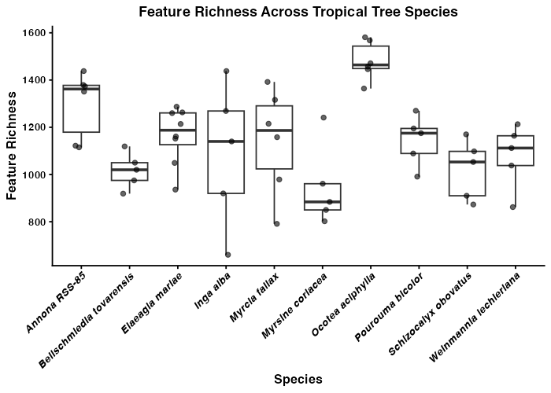

This plot shows the distribution of feature richness among samples
within each species. If one species tends to have higher richness than
another, that suggests it accumulates a broader set of detectable
metabolites under the sampling conditions used here. Wide spread within
a species indicates substantial among-sample variation, which can
reflect biological heterogeneity, environmental effects, or analytical
noise.

### 3.2 Group-average richness

The next summary moves from individual samples to the average richness
of each species. This is useful when the goal is to compare
species-level central tendencies rather than emphasize replicate-level
spread.

``` r
group_mean_richness <- GetAlphaDiversity(
  mmo,
  mode = "richness",
  threshold = 0,
  output = "group_average",
  ci = 0.95   # optional; controls lwr/upr quantiles in the summary
)
group_mean_richness
```

Differences in average richness among species can be interpreted as
differences in the typical number of detectable features per sample.
This is often a better starting point for species comparisons than
pooled richness because it does not automatically reward species with
more replicate samples.

### 3.3 Group-cumulative richness

We can also calculate cumulative richness within each species by pooling
observations across all of its samples. This asks a different question:
how many distinct features have been observed for a species across the
full set of sampled individuals?

``` r
group_pooled_richness <- GetAlphaDiversity(
  mmo,
  mode = "richness",
  threshold = 0,
  output = "group_cumulative",
  pool_method = "sum"
)

group_pooled_richness
```

Species with high cumulative richness may have either chemically diverse
individuals or simply more opportunities to detect rare features across
replicates. For teaching purposes, it is important to distinguish
cumulative richness from average per-sample richness because they answer
different biological questions.

### 3.4 Rarefied richness and accumulation curves

Finally, we can estimate accumulation curves by rarefying samples within
each species. This shows how richness increases as more individuals are
added and helps assess whether sampling is approaching saturation.

When `output = "rarefied_sample"`,
[`GetAlphaDiversity()`](https://phytoecia.github.io/eCOMET/reference/GetAlphaDiversity.md)
works within each group separately. For each sampling depth `k`, it
repeatedly draws `k` samples from that species without replacement,
pools those samples, and recalculates the chosen alpha-diversity metric.
It then summarizes the resulting distribution across permutations with a
mean and confidence interval. In other words, the curve shows the
expected richness for a species if you had collected 1, 2, 3, and so on
up to all available samples.

``` r
group_rarefied_richness <- GetAlphaDiversity(
  mmo,
  mode = "richness",
  threshold = 0,
  output = "rarefied_sample",
  n_perm = 200,    # permutations for CI
  ci = 0.95,
  seed = 1,
  pool_method = "sum"
)

group_rarefied_richness$raw
```

``` r
group_rarefied_richness$summary
```

``` r
compound_accumlation_curve <- ggplot(group_rarefied_richness$summary,
    aes(x = n_samples, y = mean, color = group, fill = group)) +
  geom_ribbon(aes(ymin = lwr, ymax = upr), alpha = 0.2, color = NA) +
  geom_line(linewidth = 0.8) +
  geom_point(size = 2) +
  labs(
    title  = "Feature Richness Accumulation by Species",
    x      = "Number of samples",
    y      = "Estimated feature richness",
    color  = "Species",
    fill   = "Species"
  ) +
  theme_classic(base_size = 12) +
  theme(
    plot.title      = element_text(face = "bold", size = 13, hjust = 0.5),
    axis.title      = element_text(face = "bold", size = 12),
    axis.text       = element_text(face = "bold", size = 10),
    axis.line       = element_line(linewidth = 0.6),
    axis.ticks      = element_line(linewidth = 0.6),
    legend.title    = element_text(face = "bold.italic", size = 10),
    legend.text     = element_text(face = "italic", size = 9)
  )

compound_accumlation_curve
```

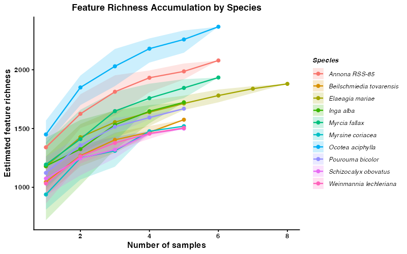

These outputs summarize both the expected richness at each sampling
depth and the underlying permutation results. Curves that begin to
plateau suggest that sampling is approaching the detectable richness of
that species, whereas steeply increasing curves suggest that additional
sampling would likely recover more features. This makes the curves
useful for comparing species while accounting for differences in sample
number.

``` r
Rarefaction_AUC <- RarefactionAUC(group_rarefied_richness, n_boot = 500)


Rarefaction_AUC_Plot <- ggplot(Rarefaction_AUC$auc_boot) +
  geom_density(aes(x = auc, fill = group)) +
  theme_classic()

Rarefaction_AUC_Plot
```

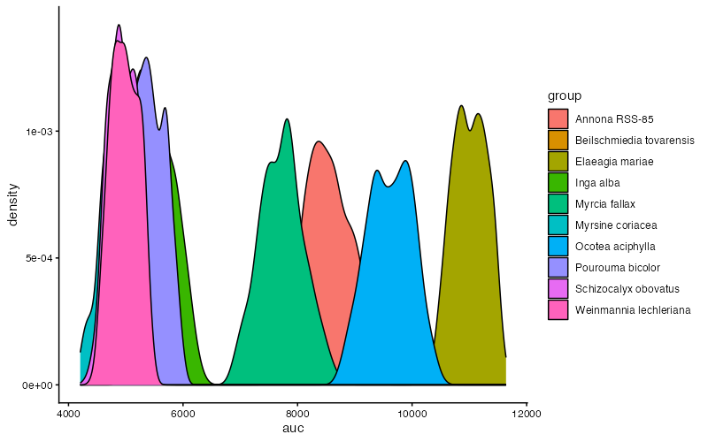

We can also summarize this by quantifying the area under the curve for
each species.

## 4. Add SIRIUS annotations and inspect class composition

Richness tells us how many features are present, but it does not tell us
what kinds of compounds those features may represent. The next step
brings in SIRIUS-based annotations so we can begin summarizing chemical
composition at a broader class level.

The main built-in annotation workflow is to load the outputs from
SIRIUS. This allows us to import CANOPUS-predicted chemical classes for
each feature, along with in silico structure predictions and their
associated class assignments.

You can also add your own custom annotations if you have an external
table that maps features to compound identities or classes.

``` r
#Add SIRIUS annotation
mmo <- AddSiriusAnnot(mmo, canopus_structuredir = demo_sirius_structure, canopus_formuladir = demo_sirius_formula)
mmo$sirius_annot
```

### 4.1 Filter CANOPUS annotations by confidence

CANOPUS assigns posterior probabilities to each compound class
prediction. We can filter out low-confidence predictions to improve the
quality of downstream enrichment analyses.

First, let’s visualize the distribution of prediction confidence:

``` r
sirius_hist <- ggplot2::ggplot(
    mmo$sirius_annot,
    ggplot2::aes(x = .data[["NPC#pathway Probability"]])
  ) +
  ggplot2::geom_histogram(bins = 40, fill = "steelblue", color = "white", linewidth = 0.3) +
  ggplot2::labs(
    title = "Distribution of NPC Pathway Probabilities",
    x     = "Probability",
    y     = "Count"
  ) +
  ggplot2::theme_classic(base_size = 12) +
  ggplot2::theme(
    plot.title = ggplot2::element_text(face = "bold", size = 13, hjust = 0.5),
    axis.title = ggplot2::element_text(face = "bold", size = 12),
    axis.text  = ggplot2::element_text(face = "bold", size = 10),
    axis.line  = ggplot2::element_line(linewidth = 0.6),
    axis.ticks = ggplot2::element_line(linewidth = 0.6)
  )

sirius_hist
```

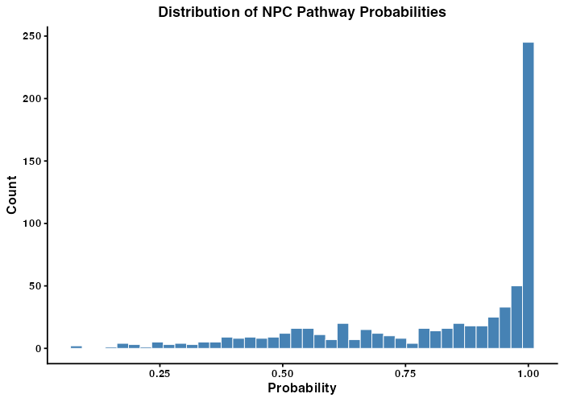

There is typically a long tail of low-confidence predictions. We can
filter these using
[`filter_canopus_annotations()`](https://phytoecia.github.io/eCOMET/reference/filter_canopus_annotations.md):

- `pathway_level`: which classification levels to filter (e.g.,
  `"NPC#pathway"`, `"All"`, `"All_NPC"`)
- `threshold`: minimum probability to retain (values below are set to
  NA)
- `suffix`: label for the filtered result

> **How to choose a threshold?** There is no universal threshold. The
> [SIRIUS
> documentation](https://v6.docs.sirius-ms.io/methods-background/#CANOPUS)
> recommends using context-dependent thresholds. For statistical
> analyses, you can sum probabilities to get expected counts rather than
> applying a hard cutoff.

``` r
mmo <- filter_canopus_annotations(
  mmo,
  pathway_level = "NPC#pathway",
  threshold     = 0.8,
  suffix        = "NPC_pathway_0.8",
  overwrite     = TRUE
)
mmo$sirius_annot_filtered_NPC_pathway_0.8
```

### 4.2 Filter structure predictions by COSMIC confidence

SIRIUS structure predictions are scored by the COSMIC confidence score.
These scores should be interpreted with caution — they are not
probabilities. The [SIRIUS team
recommends](https://www.nature.com/articles/s41587-021-01045-9) focusing
on the highest-confidence hits (e.g., top 5–10%).

``` r
# Replace -Infinity values with 0
mmo$sirius_annot_filtered_NPC_pathway_0.8$ConfidenceScoreApproximate[
  which(mmo$sirius_annot_filtered_NPC_pathway_0.8$ConfidenceScoreApproximate == "-Infinity")
] <- 0

Cosmic_Scores <- as.numeric(
  mmo$sirius_annot_filtered_NPC_pathway_0.8$ConfidenceScoreApproximate
)

cosmic_hist <- ggplot2::ggplot(
    data.frame(score = Cosmic_Scores),
    ggplot2::aes(x = score)
  ) +
  ggplot2::geom_histogram(bins = 40, fill = "steelblue", color = "white", linewidth = 0.3) +
  ggplot2::labs(
    title = "COSMIC Confidence Scores for Structures",
    x     = "Confidence Score",
    y     = "Count"
  ) +
  ggplot2::theme_classic(base_size = 12) +
  ggplot2::theme(
    plot.title = ggplot2::element_text(face = "bold", size = 13, hjust = 0.5),
    axis.title = ggplot2::element_text(face = "bold", size = 12),
    axis.text  = ggplot2::element_text(face = "bold", size = 10)
  )

cosmic_hist
```

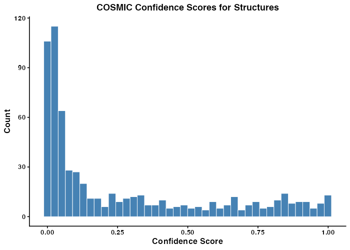

## Find the threshold for the top 10% of scores

``` r
quantile(x = Cosmic_Scores, probs = 0.9, na.rm = TRUE)
```

``` r
mmo <- filter_cosmic_structure(
  mmo,
  input       = "sirius_annot_filtered_NPC_pathway_0.8",
  cosmic_mode = "approx",
  threshold   = 0.3892,
  suffix      = "CANOPUS_0.8_COSMIC_Top_10"
)
```

Now that we have annotations we can calculate the richness per compound
class. The PlotNPCStackedBar will generate a plot to do just that.

### 4.3 Generate a NPClassifier based stacked barplot

For functions plotting functions we give the option to save the plot
directly by providing an outdir, and setting save_output = T. Otherwise
it will return a ggplot object that can be further modified.

``` r
mmo_stacked_bar <- PlotNPCStackedBar(mmo, 
    group_col = 'Species_binomial', 
    outdir = 'NPC_stakced_bar.pdf', 
    width = 8, height =4, 
    save_output = FALSE)

#Note that the plot is returned as a ggplot object so it can be easily modified by adding + to the object
p_stacked <- mmo_stacked_bar$plot +
  ggplot2::labs(
    title = "NPC Compound Class Composition\n Across Tropical Tree Species",
    x     = "Species",
    y     = "Feature Richness",
    fill  = "NPC Pathway"
  ) +
  ggplot2::theme_classic(base_size = 12) +
  ggplot2::theme(
    plot.title    = ggplot2::element_text(face = "bold", size = 13, hjust = 0.5),
    axis.title    = ggplot2::element_text(face = "bold", size = 12),
    axis.title.y   = ggplot2::element_blank(),
    axis.text.y   = ggplot2::element_text(face = "bold", size = 10),
    axis.text.x   = ggplot2::element_text(face = "bold.italic", size = 10,
                                           angle = 45, hjust = 1),
    axis.line     = ggplot2::element_line(linewidth = 0.6),
    axis.ticks    = ggplot2::element_line(linewidth = 0.6),
    legend.title  = ggplot2::element_text(face = "bold", size = 10),
    legend.text   = ggplot2::element_text(size = 9),
    legend.position = "right"
  )

p_stacked
```

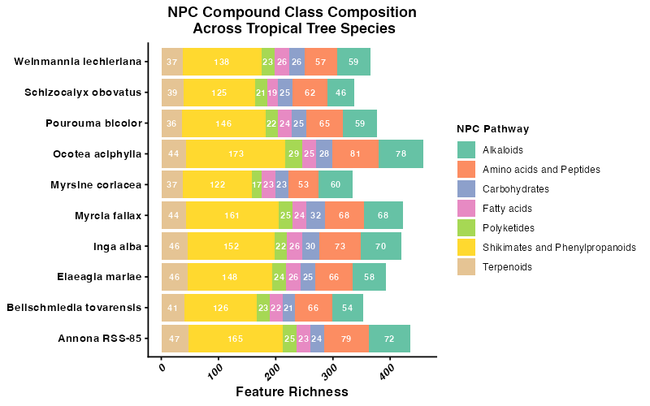

## 5. Compare samples with feature-based multivariate methods

Before introducing structure-aware methods, it is helpful to start with
standard multivariate approaches that treat each feature as an
independent variable. These methods mainly reward exact overlap in
detected features or their abundances. That is a useful baseline, but it
can be limiting in interspecific metabolomics because different species
may produce different features that are nevertheless chemically related.

### 5.1 PCA

PCA is a feature-based ordination method that reduces the dimensionality
of the abundance matrix. Here it provides a first look at whether
samples from the same species cluster together when each detected
feature is treated as an independent variable.

#### Choosing a normalization for PCA

PCA is sensitive to differences in feature magnitude — in LC-MS data,
peak areas routinely span four to six orders of magnitude. Without
scaling, a single highly abundant compound can dominate the first
principal component, and the ordination ends up summarizing little more
than “how much of that one compound is there.”

[`PCAplot()`](https://phytoecia.github.io/eCOMET/reference/PCAplot.md)
accepts a `normalization` argument that controls how the feature table
is scaled before PCA is run. The main options are:

| Option | What it does | When to use |
|----|----|----|
| `"Z"` | Z-score: mean = 0, SD = 1 per feature | Equal weight to all features; good for detecting subtle variation in rare compounds |
| `"Log"` | Log10 transformation | Compresses dynamic range while preserving relative abundance differences |
| `"PA"` | Presence/absence | Ignores abundance entirely; purely compositional |
| `"None"` | Raw peak areas | Only appropriate if you have already normalized externally |

**Z-score** is the most aggressive equalizer. Every feature — abundant
or trace — contributes equally to the PCA. The tradeoff is that noisy
low-abundance features are up-weighted alongside well-measured ones.

**Log transformation** compresses the dynamic range without fully
equalizing features. Compounds that are genuinely more abundant still
have proportionally more influence, which is often more ecologically
meaningful when dominant compounds drive a species’ chemistry.

For this interspecific comparison, we use `normalization = "Log"` to
preserve relative abundance information while bringing outlier features
closer to the range of the rest of the matrix. We also remove features
with zero variance across samples, which would cause PCA to fail.

``` r
# Remove zero-variance features (cause PCA to fail regardless of normalization)
zero_variance <- apply(mmo$feature_data[, -(1:2)], 1, var) == 0
features_to_keep <- mmo$feature_data$id[!zero_variance]
mmo <- filter_mmo(mmo, id_list = features_to_keep)

#add normalization

mmo <- MeancenterNormalization(mmo)
mmo <- LogNormalization(mmo)
mmo <- ZNormalization(mmo)

groups <- unique(mmo$metadata$group)
custom_colors <- setNames(
  grDevices::colorRampPalette(RColorBrewer::brewer.pal(12, "Set3"))(length(groups)),
  groups
)

mmo_pca <- PCAplot(mmo, color = custom_colors,
                   normalization = "Log", label = FALSE, save_output = FALSE)
```

``` r
mmo_pca$plot
```

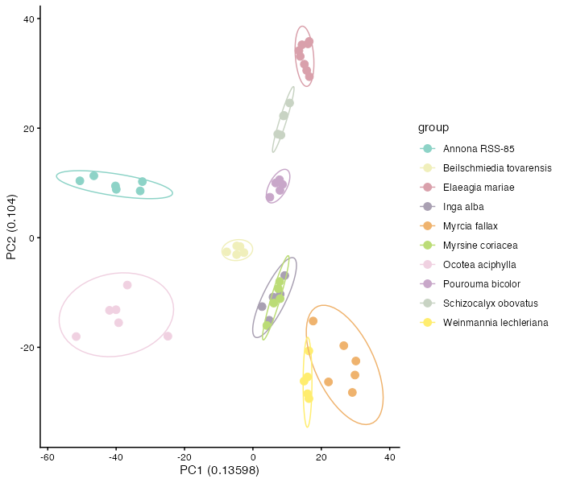

If samples from the same species cluster together in PCA space, that
suggests species differ in their overall multivariate chemical profiles.
However, PCA still depends on the observed feature matrix and does not
account for structural relatedness among unshared compounds.

### 5.2 Bray-Curtis hierarchical clustering

Bray-Curtis is another feature-based approach, but here it is used as a
distance measure for hierarchical clustering. Like PCA, it is based on
the abundance matrix and emphasizes observed overlap and abundance
differences among detected features.

We use
[`GetBetaDiversity()`](https://phytoecia.github.io/eCOMET/reference/GetBetaDiversity.md),
which like
[`GetAlphaDiversity()`](https://phytoecia.github.io/eCOMET/reference/GetAlphaDiversity.md)
can calculate several different diversity measures through a common
interface. Here we apply `"bray"`, which is feature-based and does not
require a distance matrix between compounds.

We generate a distance matrix and pass it directly to
[`HCplot()`](https://phytoecia.github.io/eCOMET/reference/HCplot.md),
which handles clustering and produces a phylogram with tips colored by
species group.

``` r
beta_diversity_dreams_bray <- GetBetaDiversity(mmo, method = 'bray',
  normalization = 'Log')

hc_bray <- HCplot(
  mmo,
  betadiv     = beta_diversity_dreams_bray,
  outdir      = "output/T2_hc_bray",
  color       = custom_colors,
  save_output = FALSE
)

# Publication-ready customisation
hc_bray_plot <- hc_bray$plot +
  ggplot2::theme(
    plot.title   = ggplot2::element_text(face = "bold", size = 13, hjust = 0.5),
    legend.title = ggplot2::element_text(face = "bold", size = 11),
    legend.text  = ggplot2::element_text(face = "italic", size = 10)
  ) +
  ggplot2::labs(title = "Sample Similarity\n(Bray-Curtis, structurally unweighted)")

hc_bray_plot
```

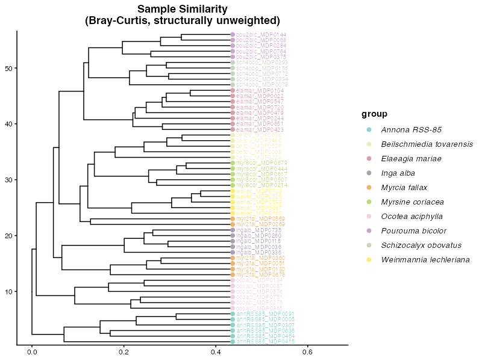

You can see that Bray Curtis distance is grouping species into their own
clusters well. This is because most species do not share features and
thus form unique clusters.

This is an important teaching moment. Strong species-level clustering
under Bray-Curtis can reflect real chemical differentiation, but it can
also be driven by the fact that many species do not share exact features
at all. In that situation, feature-overlap methods may exaggerate
separation even when species produce structurally related metabolites.

## 6. Add structural relationships among features

Feature-overlap metrics become limited when most compounds are unique to
one species. Two species may appear completely dissimilar even if they
produce related compounds from the same biosynthetic pathways. To
address that limitation, we next add chemical distance information
derived from DREAMS so that similarity can be evaluated among compounds,
not just among exact matching features.

We introduce feature-based molecular networking and compound dendrograms
that group mz-features into structurally similar groups on a tree.

``` r
# Add Dreams distance
mmo <- AddChemDist(mmo, dreams_dir = demo_dreams)

mmo$dreams.dissim[1:10,1:10]
```

This matrix stores pairwise chemical dissimilarity among features. Once
this information is available, later analyses can distinguish between
features that are unrelated and features that are distinct but still
structurally similar.

## 7. Recalculate beta diversity using chemical distances

Now that we have a matrix describing relationships among compounds, we
can recalculate sample-to-sample dissimilarity in a way that uses
chemical relatedness among unshared features. This is the key conceptual
shift in the tutorial: samples no longer need to share the exact same
detected feature to be considered chemically similar.

### A note on controlling feature abundance in `GetBetaDiversity()`

Each method in
[`GetBetaDiversity()`](https://phytoecia.github.io/eCOMET/reference/GetBetaDiversity.md)
treats feature abundance differently, and the levers available to you
depend on which method you are using.

- **Bray-Curtis (`method = "bray"`)**: Abundance is used directly in the
  dissimilarity formula. You control how much influence high-abundance
  features have through the `normalization` argument.
  `normalization = "None"` uses raw peak areas, `normalization = "Log"`
  compresses the dynamic range so that very abundant features have less
  outsized influence, and `normalization = "PA"` converts everything to
  presence/absence so abundance is ignored entirely.

- **Jaccard (`method = "jaccard"`)**: Jaccard is a presence/absence
  measure by definition. The `normalization` argument is ignored — the
  function always uses the presence/absence table internally and will
  issue a warning if you supply anything else. This means Jaccard
  answers the question: do these two samples detect the same compounds
  at all, regardless of how much of each compound is present?

- **CSCS (`method = "CSCS"`)**: Like Bray-Curtis, CSCS is sensitive to
  abundance by default and you control that sensitivity through
  `normalization`. The key difference from Bray-Curtis is that CSCS also
  uses the compound distance matrix, so structurally related features
  that are not identical can still contribute to similarity.
  `normalization = "None"` makes highly abundant features drive the CSCS
  score; `normalization = "PA"` makes it a purely structural comparison
  based on which chemical neighborhoods are represented.

- **Generalized UniFrac (`method = "Gen.Uni"`)**: This method computes
  three distance matrices in a single pass, each with a different
  abundance-weighting level controlled by an internal `alpha` parameter.
  Rather than choosing one upfront,
  [`GetBetaDiversity()`](https://phytoecia.github.io/eCOMET/reference/GetBetaDiversity.md)
  returns all three as a named list so you can compare or choose the
  most appropriate one:

  - `d_0`: presence/absence only — equivalent to unweighted UniFrac. Use
    this when you want to know whether the same chemical branches are
    represented, regardless of how much of each compound is present.
  - `d_0.5`: balanced weighting (recommended starting point). Moderates
    the influence of highly abundant features without ignoring abundance
    entirely.
  - `d_1`: fully abundance-weighted. Dominant features drive the
    distance. Use this when peak intensity is a reliable biological
    signal and you want the most abundant compounds to have the most
    influence.

We present two structure-aware methods below:

### 7.1 Chemical structural and compositional similarity (CSCS)

CSCS incorporates relationships among compounds when calculating
dissimilarity. Two samples can therefore be considered more similar if
they contain different features that are nonetheless chemically related.

``` r
beta_diversity_dreams_CSCS <- GetBetaDiversity(mmo, method = 'CSCS',
  normalization = 'Log', distance = "dreams")

hc_cscs <- HCplot(
  mmo,
  betadiv       = beta_diversity_dreams_CSCS,
  outdir        = "output/HC_CSCS",
  hclust_method = "ward.D2",
  color         = custom_colors,
  save_output   = FALSE
)
hc_cscs$plot
```

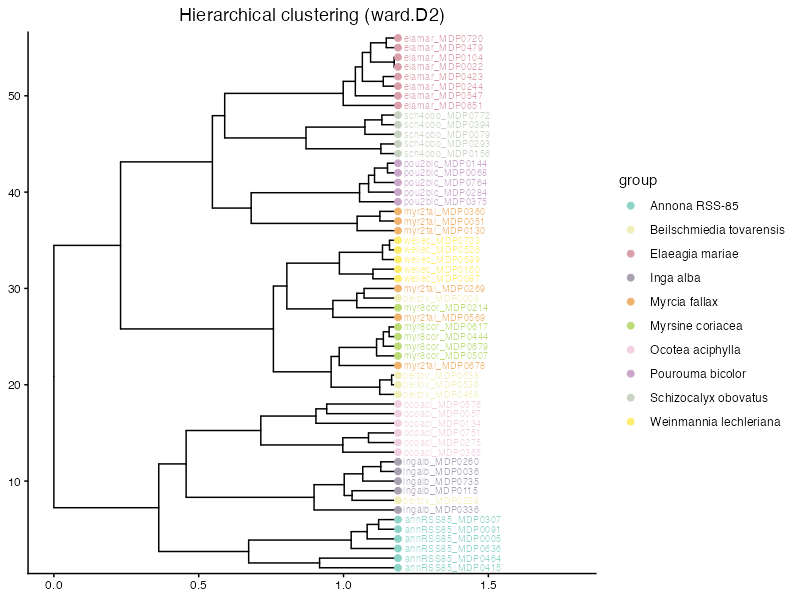

Relative to Bray-Curtis, CSCS should often reduce the apparent distance
between samples that lack shared exact features but still contain
compounds from similar chemical neighborhoods.

### 7.2 Generalized UniFrac

Generalized UniFrac uses the feature dendrogram to partition differences
among samples across branches of the chemical tree. Instead of asking
only whether the same features are present, it asks how much chemical
branch length is shared or unique across samples.

``` r
beta_diversity_dreams_Gen.Uni <- GetBetaDiversity(mmo, method = 'Gen.Uni',
  normalization = 'Log', distance = "dreams")
# GetBetaDiversity() prints a message listing the three available matrices.
# Inspect the names:

# Choose one weighting level before passing to HCplot.
# Here we use d_1 (abundance-weighted), which is the recommended default.
hc_GenUni <- HCplot(
  mmo,
  betadiv       = beta_diversity_dreams_Gen.Uni[["d_1"]],
  outdir        = "output/HC_GenUni",
  hclust_method = "ward.D2",
  color         = custom_colors,
  save_output   = FALSE
)
hc_GenUni$plot
```

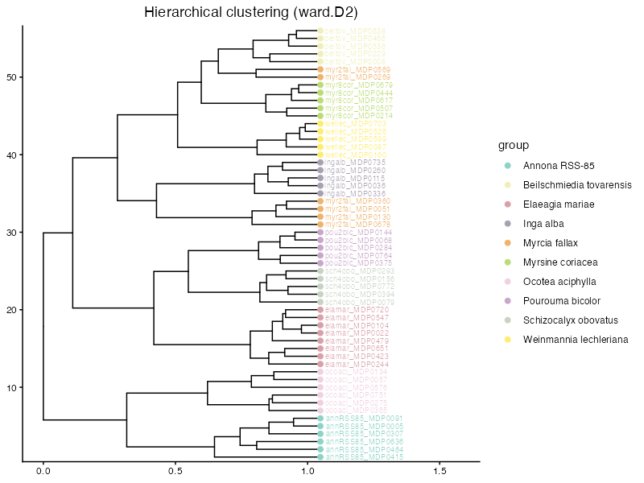

Both CSCS and Generalized UniFrac move beyond exact feature overlap. In
an interspecific dataset, that is often the biologically appropriate
comparison because species can produce different compounds that still
belong to related structural classes.

### 7.3 Ordination using structure-aware distances

We can use these distance matrices directly in ordination methods such
as NMDS and PCoA. These plots summarize multivariate dissimilarity among
samples in a low-dimensional space.

``` r
groups <- unique(mmo$metadata$group)
custom_colors <- setNames(grDevices::colorRampPalette(RColorBrewer::brewer.pal(12, "Set3"))(length(groups)), groups)

NMDS <- NMDSplot(mmo, color= custom_colors,betadiv = beta_diversity_dreams_CSCS, outdir = 'output/NMDS', width = 6, height = 6)
```

``` r
NMDS$plot
```

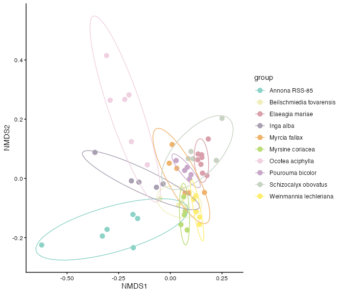

In an NMDS plot, points that are closer together represent samples with
more similar chemical profiles under the chosen distance metric. If
samples from the same species cluster tightly and species separate from
one another, that suggests consistent species-level differences in
chemistry. Overlap among species indicates greater similarity or weaker
taxonomic structure.

We can also control the beta diversity metrix in a PCOA plot. Here we
use the Gen.Uni

``` r
groups <- unique(mmo$metadata$group)
custom_colors <- setNames(grDevices::colorRampPalette(RColorBrewer::brewer.pal(12, "Set3"))(length(groups)), groups)

PCOA_example <- PCoAplot(mmo, color= custom_colors,betadiv = beta_diversity_dreams_Gen.Uni[["d_1"]], outdir = 'output/PCOA', width = 6, height = 6)
```

``` r
PCOA_example$plot
```

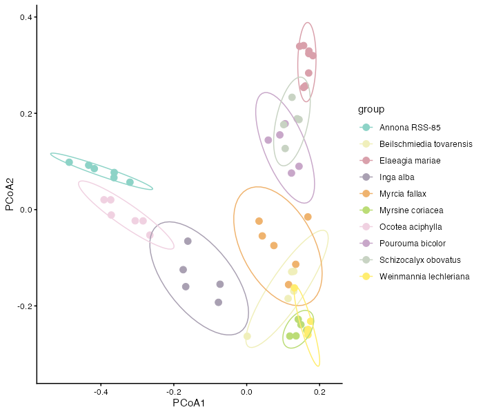

PCoA can be interpreted similarly, although the axes are derived
differently. The main point is that ordinations based on CSCS or
Generalized UniFrac summarize chemistry after incorporating
relationships among compounds, not just exact shared features.

To compare how clusters differ when we incorporate structurally weighted
beta distances, we place Bray-Curtis and Generalized UniFrac (d_1) PCoAs
side by side. Because the two distance matrices are on different scales,
each panel has free axes — interpret only the relative grouping of
points across panels, not the axis values.

``` r
PCOA_example_bray <- PCoAplot(
  mmo,
  color       = custom_colors,
  betadiv     = beta_diversity_dreams_bray,
  outdir      = "output/PCOA_bray",
  save_output = FALSE
)

# Combine data frames and label by method
pcoa_bray_df        <- PCOA_example_bray$df
pcoa_bray_df$method <- "Bray-Curtis"

pcoa_genuni_df        <- PCOA_example$df
pcoa_genuni_df$method <- "Generalized UniFrac (d_1)"

pcoa_combined <- rbind(pcoa_bray_df, pcoa_genuni_df)
pcoa_combined$method <- factor(pcoa_combined$method,
  levels = c("Bray-Curtis", "Generalized UniFrac (d_1)"))

# Faceted comparison — publication figure
pcoa_comparison <- ggplot2::ggplot(
    pcoa_combined,
    ggplot2::aes(x = .data$PCoA1, y = .data$PCoA2, color = .data$group)
  ) +
  ggplot2::geom_point(size = 3) +
  ggplot2::stat_ellipse(level = 0.90) +
  ggplot2::scale_color_manual(values = custom_colors, name = "Species") +
  ggplot2::facet_wrap(~ method, scales = "free") +
  ggplot2::theme_classic(base_size = 12) +
  ggplot2::theme(
    strip.text      = ggplot2::element_text(face = "bold", size = 12),
    legend.position = "right",
    axis.title      = ggplot2::element_text(face = "bold"),
    legend.text     = ggplot2::element_text(face = "italic")
  ) +
  ggplot2::labs(
    x     = "PCoA1",
    y     = "PCoA2",
    title = "Beta Diversity: Feature-based vs. Structurally-weighted"
  )

pcoa_comparison
```

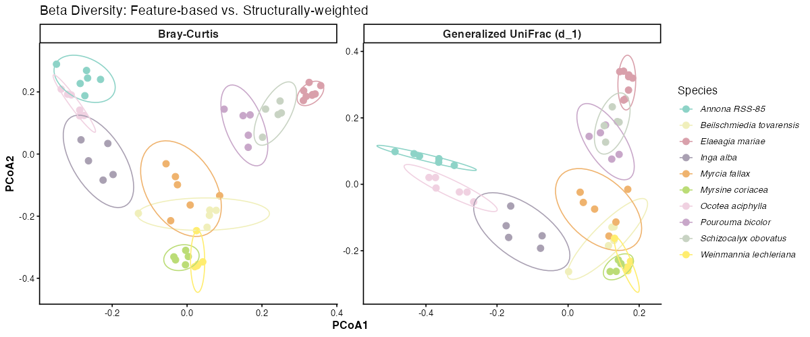

## 8. structure-aware alpha diversity

So far, our alpha diversity summaries have treated each feature as
equally distinct. We now revisit alpha diversity using structure-aware
information so that chemically similar compounds do not contribute as
much unique diversity as chemically distant compounds. This gives a more
functional view of chemical diversity within each sample or species.

``` r
group_mean_functionalhill <- GetAlphaDiversity(
  mmo,
  normalization = "Log",
  distance = "dreams",
  mode = "weighted",
  threshold = 0,
  output = "sample_level",
  ci = 0.95   # optional; controls lwr/upr quantiles in the summary
)
group_mean_functionalhill


sample_hill_number <- ggplot2::ggplot(group_mean_functionalhill, ggplot2::aes(x = group, y = value)) +
  ggplot2::geom_boxplot(outlier.shape = NA) +
  ggplot2::geom_jitter(width = 0.15, height = 0, alpha = 0.6) +
  ggplot2::labs(
    x = "Species",
    y = "Functional Hill Number"
  ) +
  ggplot2::theme_classic() +
  ggplot2::theme(
    axis.text.x = element_text(angle = 90, hjust = 0.5) 
  )+
    scale_y_log10() 

library(cowplot)
p1 <- Sample_Richness +
  theme(
    axis.title.x = element_blank(),
    axis.text.x  = element_blank(),
    axis.ticks.x = element_blank(),
    plot.margin = margin(t = 5.5, r = 5.5, b = 0, l = 5.5)
  )

p2 <- sample_hill_number +
  theme(
    plot.margin = margin(t = 0, r = 5.5, b = 5.5, l = 5.5)
  )

combined_plot <- plot_grid(
  p1,
  p2,
  ncol = 1,
  align = "v",
  axis = "lr",
  rel_heights = c(1, 2.5)
)
```

``` r
combined_plot
```

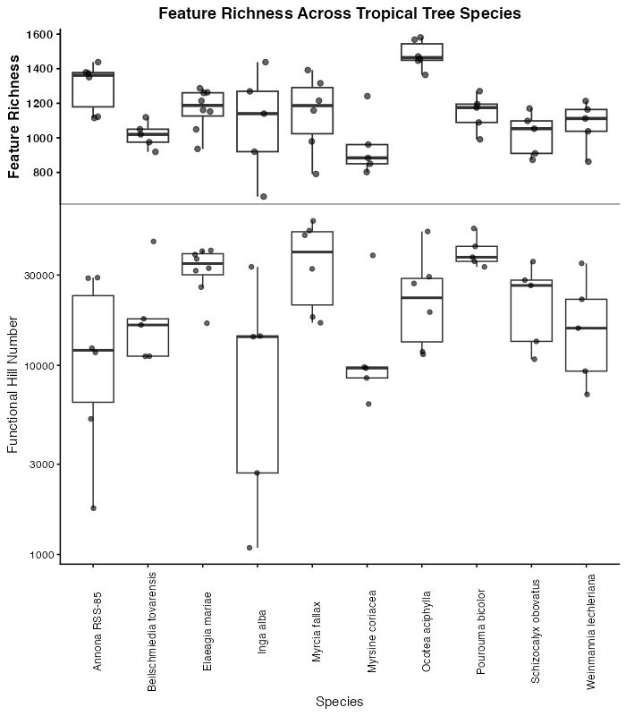

If richness counts every detected feature equally, structure-aware
diversity asks whether those features represent many different kinds of
chemistry or many closely related variants of the same chemistry.
Species with similar raw richness can therefore differ in functional
Hill diversity if one contains a broader range of chemical types.

``` r
rarefied_functionalhill <- GetAlphaDiversity(
  mmo,
  normalization = "Log",
  distance = "dreams",
  mode = "weighted",
  threshold = 0,
  output = "rarefied_sample",
  ci = 0.95,   # optional; controls lwr/upr quantiles in the summary
  n_perm = 200,
  seed = 1,
  pool_method = "sum",
  q = 1
)


rarefied_functionalhill$summary
rarefied_functionalhill$raw
```

here we plot the functional richness accumulation curve

``` r
functional_hill_compound_accumlation_curve <- ggplot(rarefied_functionalhill$summary, aes(x = n_samples, y = mean, color = group, fill = group)) +
  geom_ribbon(aes(ymin = lwr, ymax = upr), alpha = 0.2, color = NA) +
  geom_line(linewidth = 1) +
  geom_point(size = 2) +
  labs(
    x = "Number of samples",
    y = "Estimated feature richness",
    color = "Species",
    fill = "Species"
  ) +
  theme_classic()

functional_hill_compound_accumlation_curve
```

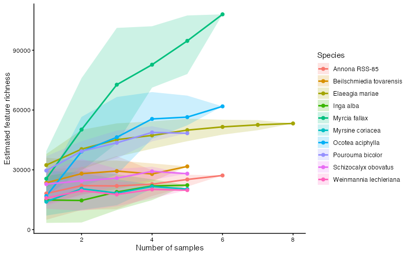

Rarefying the structure-aware diversity estimates can help distinguish
species that have both high chemical diversity and broad structural
coverage from species whose diversity saturates quickly as more samples
are added.

## Key takeaways

This workflow begins with standard feature-based summaries and then
extends them by introducing information about structural similarity
among compounds. That progression is especially important in
interspecific studies, where exact feature overlap is often low even
when samples are chemically related at the pathway or structural-class
level.

In practice, it is often useful to compare both feature-based and
structure-aware results side by side. When the two approaches agree,
that strengthens the biological interpretation. When they differ, the
discrepancy can reveal that species are producing different but related
compounds.
